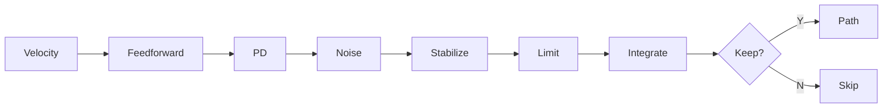
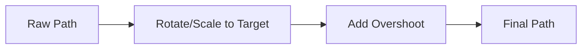

# Path Generation Algorithm

This document explains how the `PDPathGenerator` creates human-like mouse paths using a PD (Proportional-Derivative) controller approach.

## Overview

The generator simulates how a human moves a mouse cursor from point A to point B. Rather than moving in a perfect straight line, humans exhibit:

- **Initial direction error** - We don't aim perfectly at the start
- **Curved trajectories** - Natural arc toward the target
- **Velocity profiles** - Fast in the middle, slow near the target (Fitts's Law)
- **Micro-corrections** - Small adjustments along the way
- **Hand tremor** - Slight noise/wobble in movement
- **Overshoot** - Sometimes going past the target and correcting

## The Unit-Frame Approach

Instead of working directly in screen coordinates, we transform the problem into a normalized "unit frame":

```
Screen Space                    Unit Space
    
    target (500, 300)               
       ●                        start        target
      /                           ●------------●
     /                          (0, 0)       (1, 0)
    /                            
   ●                            
start (100, 200)              
```

??? abstract "Deep Dive: The Math Behind `get_unit_transform`"
    
    The `get_unit_transform` function is the mathematical foundation of the coordinate system. Its goal is to take a movement happening at **any angle or distance** and translate it into a standardized "unit frame" where the start is always $(0,0)$ and the target is always $(1,0)$.
    
    Here is a step-by-step breakdown of how the code achieves this:
    
    ### 1. Coordinate Unpacking
    
    ```python
    sx, sy = start
    tx, ty = target
    ```
    
    The function receives two numpy arrays as input:
    
    - `start`: The mouse's current position in screen pixels, e.g., `np.array([100, 200])`
    - `target`: Where the mouse needs to go, e.g., `np.array([500, 300])`
    
    It unpacks these into individual $x$ and $y$ variables: **Start** $(sx, sy)$ and **Target** $(tx, ty)$.
    
    ### 2. Finding the Displacement Vector
    
    ```python
    v = np.array([tx - sx, ty - sy], dtype=np.float32)
    ```
    
    It calculates the **displacement vector** $\vec{v}$ by subtracting the start from the target.
    
    This vector represents the raw direction and distance the mouse needs to travel in screen pixels.
    
    ### 3. Calculating the Euclidean Distance ($D$)
    
    ```python
    D = float(np.hypot(v[0], v[1])) or 1.0
    ```
    
    `np.hypot` calculates the **magnitude** (length) of vector $\vec{v}$ using the Pythagorean theorem:
    
    $$D = \sqrt{v_x^2 + v_y^2}$$
    
    The `or 1.0` is a safety mechanism to prevent "division by zero" errors if the start and target points are identical.
    
    This distance $D$ becomes the **scaling factor** used later to shrink the path down to a unit length of $1.0$.
    
    ### 4. Vector Normalization
    
    ```python
    v /= D
    c, s = v[0], v[1]
    ```
    
    By dividing the displacement vector by its own distance, the function creates a **unit vector** (a vector with a length of exactly $1.0$).
    
    In trigonometry, the $x$ and $y$ components of a unit vector are equivalent to the $\cos(\theta)$ and $\sin(\theta)$ of the angle of that vector:
    
    $$\hat{v} = (\cos\theta, \sin\theta)$$
    
    The variables `c` and `s` now store these trigonometric values for the rotation matrix.
    
    ### 5. Constructing the Rotation Matrix ($R$)
    
    ```python
    R = np.array([[c, s],
                  [-s, c]], dtype=np.float32)
    ```
    
    The function builds a $2 \times 2$ rotation matrix:
    
    $$R = \begin{bmatrix} \cos\theta & \sin\theta \\ -\sin\theta & \cos\theta \end{bmatrix}$$
    
    This specific configuration is designed to rotate the entire coordinate system by $-\theta$.
    
    When applied to any point, it **"un-rotates"** the world so that the target point, regardless of where it was originally, now sits perfectly on the positive X-axis relative to the start point.
    
    ### Summary of the Output
    
    The function returns two pieces of data that allow the `PDPathGenerator` to work in a simplified environment:
    
    | Output | Purpose |
    |--------|---------|
    | $R$ (Rotation) | Tells the generator how to align the world so the target is "straight ahead" |
    | $D$ (Distance) | Tells the generator how much to scale the movement so the target is exactly "one unit" away |
    
    ### Conversion Formulas
    
    **Screen → Unit:**
    ```python
    P_unit = (P_screen - start) @ R.T / D
    ```
    
    **Unit → Screen:**
    ```python
    P_screen = start + (P_unit * D) @ R
    ```

**Why?** This makes the algorithm resolution-independent. All the physics and tuning works the same whether you're moving 50 pixels or 500 pixels.

**The process:**

??? info "Step 1: Normalize"
    Rotate and scale the coordinate system so that start→target becomes a simple horizontal line from (0,0) to (1,0).
    
    This transforms any diagonal movement into a standardized problem where we only need to move "right" along the X-axis.
    
    

??? info "Step 2: Simulate"
    Run the path simulation in this simplified unit space. The controller only needs to:
    
    - Move forward (increase X from 0 toward 1)
    - Correct Y deviations back toward 0
    - Apply human-like noise and velocity profiles
    
    

??? info "Step 3: Transform Back"
    Apply the inverse rotation and scaling to transform the simulated path back to screen coordinates.
    
    The curved path in unit space becomes a curved path between your actual start and target points.
    
    

## Transformation Pipeline

The physics simulation loop logically applies these transformations in order during every iteration:



**Select a step below to see its implementation:**

=== "1. Feedforward"

    **Feedforward + Braking**
    
    > **Implementation:** Inlined physics calculation
    
    Maintains forward motion with **Fitts's Law** deceleration. Humans naturally slow down as they approach a target.
    
    ```python
    dist_rem = 1.0 - progress
    brake = clip(dist_rem * 4.0, 0.15, 1.0)
    v_unit = direction * (mouse_velocity * brake)
    ```
    
    | Progress | Brake Factor |
    |----------|--------------|
    | 0-75% | 1.0 (full speed) |
    | 85% | 0.6 (slowing) |
    | 95% | 0.2 (crawling) |

=== "2. PD Correction"

    **PD Correction**
    
    > **Implementation:** Inlined physics calculation
    
    Steers toward target using **proportional-integral control** with adaptive gain.
    
    ```python
    # Blended KP based on progress
    current_kp = weight_far * kp_start + weight_near * kp_end
    
    # Error toward target (and arc)
    err_x = 1.0 - P_unit[0]
    err_y = ideal_y - P_unit[1]
    
    # Apply correction
    v_unit += current_kp * 20.0 * err_unit + ki * err_sum
    ```
    
    **Arc Trajectory:** When `arc_strength > 0`, the path follows a sine curve for natural curvature.

=== "3. Noise"

    **Noise (Ornstein-Uhlenbeck)**
    
    > **Implementation:** Inlined physics calculation
    
    Smooth, **correlated random perturbations** simulating hand tremor.
    
    ```python
    theta = 0.15  # Mean reversion rate
    sigma = noise_strength * 0.002
    
    # Noise decays near target
    noise_factor = (1.0 - progress) ** 1.3
    
    # Update: pull toward zero + random kick
    noise_state += (-theta * noise_state) + (sigma * random)
    v_unit += noise_state * noise_factor
    ```
    
    The noise automatically **fades near the target** to ensure accurate arrival.

=== "4. Stabilization"

    **Stabilization**
    
    > **Implementation:** Inlined physics calculation
    
    **Damping and smoothing** for natural, flowing motion.
    
    ```python
    # Damping: resist sudden changes
    v_unit -= damp * (v_unit - v_previous)
    
    # Smoothing: blend with previous velocity
    alpha = 1.0 - stabilization
    v_unit = alpha * v_unit + (1 - alpha) * v_previous
    ```

=== "5. Step Limiting"

    **Step Limiting**
    
    > **Implementation:** Inlined physics calculation
    
    Prevents **unrealistic jumps** and backward motion.
    
    ```python
    # Limit magnitude (tighter near target)
    step_limit = max_step * (0.5 + 0.5 * (1 - progress)**1.5)
    if magnitude > step_limit:
        v_unit *= step_limit / magnitude
    
    # Prevent backing up
    v_unit[0] = min(v_unit[0], 1.0 - current_x)
    ```

=== "6. Integration"

    **Integration**
    
    > **Implementation:** Inlined physics calculation
    
    **Euler integration** to update position based on velocity.
    
    ```python
    P_next = P_unit + v_unit
    P_next[0] = clip(P_next[0], -0.05, 1.0)
    
    # Convert through screen coords for consistency
    new_px = unit_to_screen(P_next)
    P_unit = screen_to_unit(new_px)
    ```

=== "7. Point Density"

    **Point Density**
    
    > **Implementation:** Inlined physics calculation
    
    Controls how many points are kept. **Sparser at start**, **denser at end**.
    
    ```python
    # Interpolate probability
    keep_prob = keep_prob_start + (keep_prob_end - keep_prob_start) * progress
    
    # Always keep points near end
    return random() < keep_prob or progress >= 0.97
    ```
    
    | Phase | Keep Probability |
    |-------|-----------------|
    | Start (fast) | ~70% |
    | End (slow) | ~98% |

---

**Post-processing** (applied after simulation):



---

## Post-Processing

After the simulation loop completes, two final transforms are applied:

### Rotation/Scale Transform

The path is rotated and scaled to ensure it **exactly** hits the target endpoint. This compensates for any accumulated numerical error during simulation.

### Overshoot

> **Method:** `_apply_overshoot`

When triggered (based on `overshoot_prob`):

1. **Overshoot phase**: Continue past target in the movement direction (3-8% of path distance)
2. **Recovery phase**: Curve back toward the target with eased motion

```
        overshoot
           ↗ ⟍
target ●←----
       recovery
```

---

## Parameter Reference

| Parameter | Range | Description |
|-----------|-------|-------------|
| `mouse_velocity` | 0.1 - 1.0 | Base velocity in unit space |
| `kp_start` | 0.0 - 0.1 | Correction strength at path start |
| `kp_end` | 0.0 - 0.1 | Correction strength near target |
| `stabilization` | 0.0 - 1.0 | Smoothing/damping factor |
| `noise` | 0.0 - 1.0 | Hand tremor intensity |
| `arc_strength` | 0.0 - 0.5 | Curvature of arc trajectory |
| `arc_sign` | -1 or +1 | Direction of arc (up/down in unit space) |
| `keep_prob_start` | 0.0 - 1.0 | Point density at start |
| `keep_prob_end` | 0.0 - 1.0 | Point density at end |
| `variance` | 0.0 - 0.5 | Random variation in all parameters |
| `overshoot_prob` | 0.0 - 1.0 | Chance of overshooting target |
| `offset_x` / `y` | Any | Global offset added to output coordinates |
| `canvas_width` / `h` | Pixels | Used for scaling variance relative to screen size |

For detailed presets and tuning examples, see [Tuning Parameters](examples/tuning.md).
